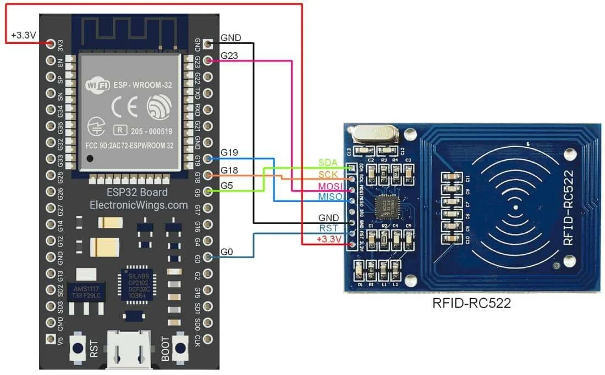
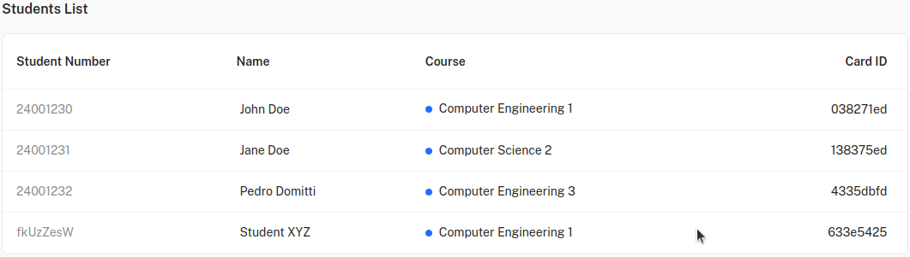
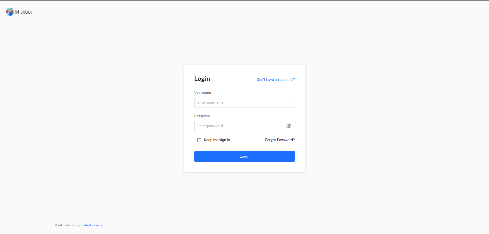
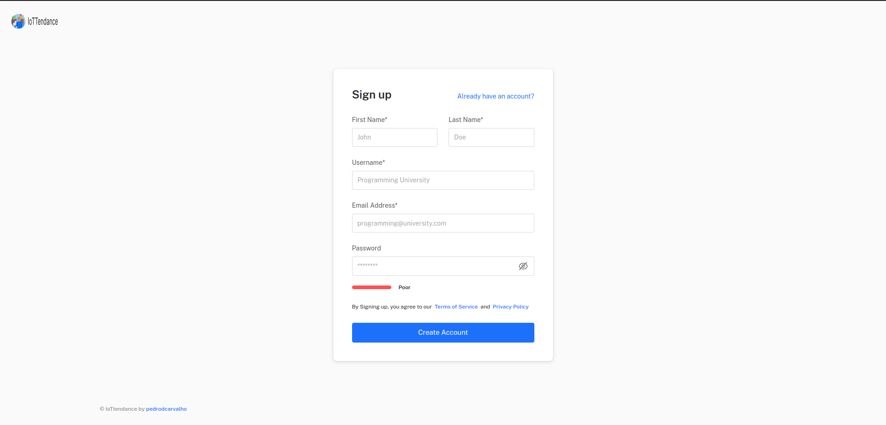
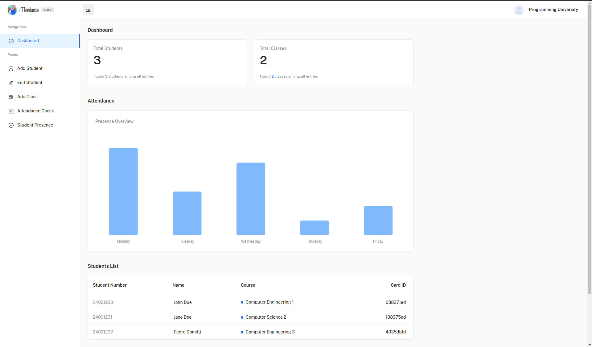
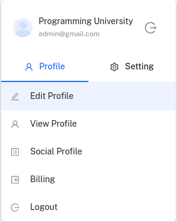
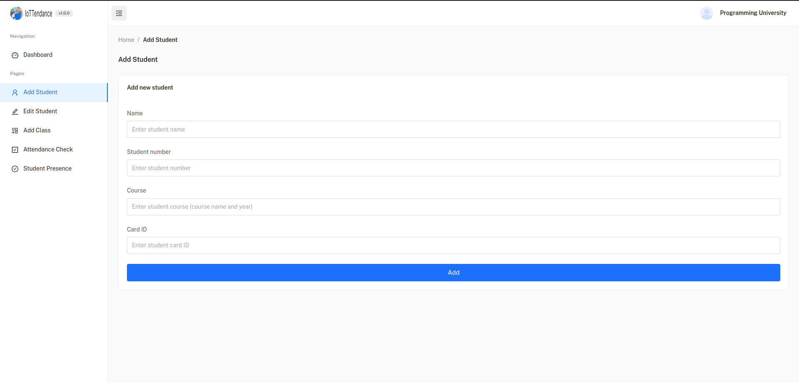
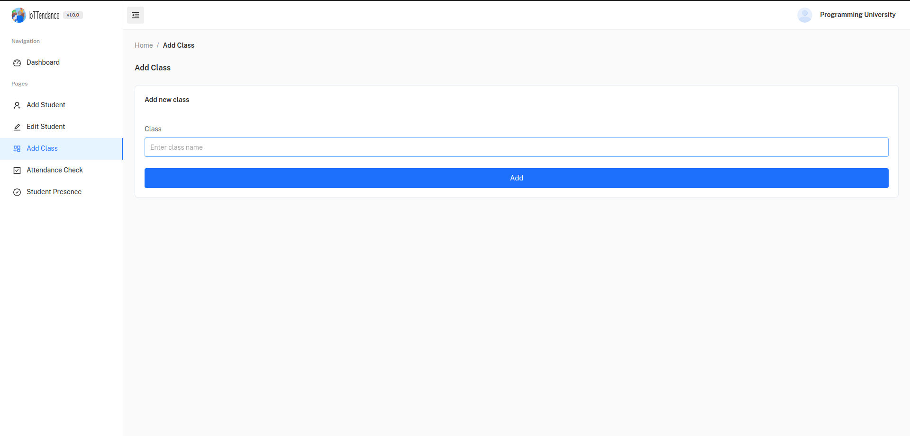
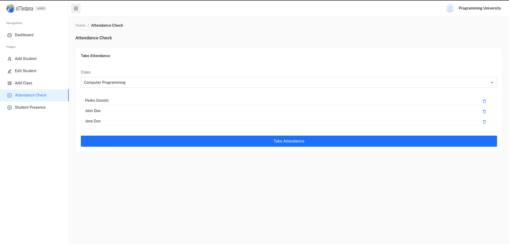
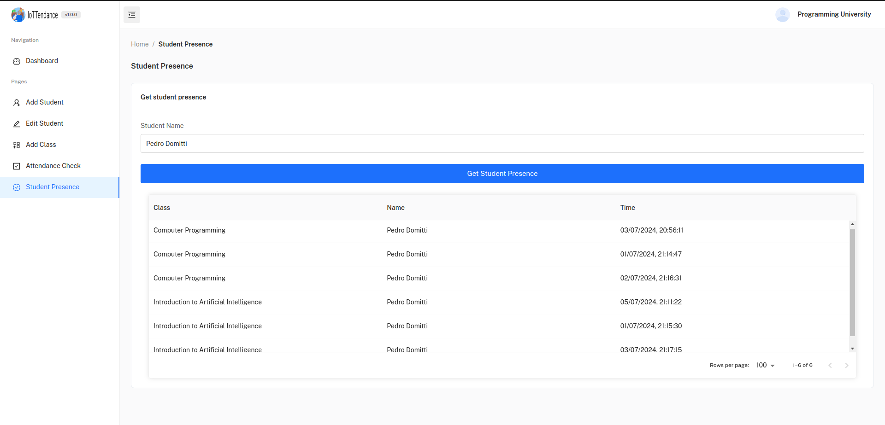

<div align="center">
  
</div>

---

<div align="center">

## Status and Future Work

**Beta Version**

This project is currently in its prototype stage. While the core functionalities are in place, there may still be bugs fixed and features to be added. Future updates will include:

- Enhancements to the user interface and experience.
- More robust error handling and security features (Also for success toast/messages).
- Additional features such as notifications for attendance anomalies and mobile app support.
- Integration with external systems for extended functionality.

Stay tuned for updates and improvements as we continue to develop and refine IoTTendance!

### Tech Stack and Tools


</div>

<details>
  <summary>Table of Contents</summary>
  <ol>
    <li>
      <a href="#overview">Overview</a>
    </li>
    <li>
      <a href="#features">Features</a>
    </li>
    <li>
      <a href="#installation">Installation</a>
    </li>
    <li>
      <a href="#usage">Usage</a>
    </li>
    <li>
      <a href="#license">License</a>
    </li>
    <li>
      <a href="#documentation">Documentation</a>
      <ul>
        <li><a href="#server-side-technologies">Server-Side Technologies</a></li>
        <li><a href="#client-side-technologies">Client-Side Technologies</a></li>
        <li><a href="#other-technologies">Other Technologies</a></li>
        <li><a href="#development-process">Development Process</a></li>
        <li><a href="#development-structure">Development Structure</a></li>
        <li><a href="#development-information">Development Information</a></li>
        <li><a href="#development-tools">Development Tools</a></li>
      </ul>
    </li>
  </ol>
</details>

## Overview

This repository contains the code and documentation of the IoTTendance app. The app is designed to provide primarily schools and universities with a smart attendance system that uses IoT devices (ESP32 and RFID sensor) to track student attendance in real-time. The system uses RFID technology to identify students and record their attendance automatically. The app also provides teachers and administrators with tools to manage attendance data, generate reports, and monitor student attendance patterns.

## Features

- **Interactive all-in-one dashboard**: The app provides an interactive dashboard that allows users to view attendance data, list of students, number of classes/students, and other relevant information at a glance.

- **Account Creation**: Different institutions can create accounts and manage their attendance data through the app. Each account has a unique ID and password for security. There is dedicated registration and login functionality for teachers and administrators (and logout).

- **Attendance Tracking**: The app uses RFID technology to track student attendance in real-time. Students can use RFID cards to check in and out of classes.

- **Add, Delete, Update Students**: Teachers can add, delete, and update student information in the system.

- **Class Management**: Teachers can create classes and add students to them. They can also view class schedules and attendance data.

- **Attendance Check**: Teachers can take attendance using the app for one of the classes created in the system.

- **Attendance Reports**: Teachers and administrators can generate attendance reports for individual students.

## Installation

1. Clone the repository.

```bash
git clone https://github.com/pedrodcarvalho/IoTTendance.git
```

2. Directory setup.

- Because of how the directory is structured you will need to open side by side terminals, one for the client and the other for the server.

In the root directory, open two terminals.

```bash
cd ./client
```

```bash
cd ./server
```

3. Install dependencies.

Inside the client terminal, run the following command.

```bash
yarn
```

Inside the server terminal, run the following command.

```bash
npm install
```

4. Environment variables setup.

For local run, create a `.env` file in the server directory with the following content.

```bash
PORT=<Server port>
SESSION_SECRET=<Secret>
MONGODB_USERNAME=<MongoDB username>
MONGODB_PASSWORD=<MongoDB password>
JWT_SECRET=<Secret>
```

And in the IoT directory inside the `main.cpp` file, change the following lines with your WiFi credentials.

```cpp
const char *ssid = "WiFi Name";
const char *password = "WiFi Password";
const char *ipAddress = "Router IPv4 Address";
```

You will need to create a MongoDB database. For this, please refer to the [MongoDB documentation](https://docs.mongodb.com/manual/installation/).

5. IoT setup.



- After following the instruction above to connect the ESP32 with the RFID sensor, using the VSCode extensinon named PlatformIO install the required headers (links2004/WebSockets@^2.4.1, miguelbalboa/MFRC522@^1.4.11) inside your PIO project and upload the `main.cpp` code to the ESP32.
- For more information, please refer to the [PlatformIO documentation](https://docs.platformio.org/en/latest/).

## Usage

To run the app locally, simply use the following commands in both terminals (client and server).

```bash
npm start
```

## Extra:

- To add a new student to the system the easiest way is to simply approach the RFID card to the RFID sensor when inside the dashboard page. The ESP32 will send the data to the server and the server will add the student to the database.

- You will notice that a random `Student Number` and `Student Name` will be generated. Then you can go to the `Edit Students` page and update the student information there.



## License

This project is licensed under the MIT License. See the [LICENSE](LICENSE) file for details.

## Documentation





**User Authentication**: Users can create accounts and log in securely.

<br>
<br>
<br>



**Dashboard Preview**: When users log in, they are greeted with a dashboard that displays key information such as: attendance data, list of students, number of classes/students, and other relevant information.

<br>
<br>
<br>



**Profile Dropdown**: Dedicated profile dropdown for user settings and account management. (Logout functionality included on it)

<br>
<br>
<br>



**Add Student**: Teachers can add new students to the system by entering their information.

<br>
<br>
<br>


**Edit Student**: Teachers can edit student information, such as name, student number, and other details.

<br>
<br>
<br>



**Add Class**: Teachers can create new classes.

<br>
<br>
<br>



**Attendance Check**: Teachers can take attendance for a specific class.

<br>
<br>
<br>



**Student Presence**: Teachers can view the presence of students in a specific class.

### Server-Side Technologies

- **Node.js**: Runtime environment to execute server-side JavaScript code.

- **Express.js**: Node.js framework for building robust web applications and RESTful APIs.

- **Database**: MongoDB for storing user data and investment information.

### Client-Side Technologies

- **HTML/CSS/JavaScript/React**: Core web technologies for the user interface.

### Other Technologies

- **RESTful API**: To handle client-server communication.

- **WebSockets**: For real-time RFIDs data transmission from ESP32 to the server.

## Development Process

The project was developed using an agile approach, with a focus on flexibility and adaptability. The development process was divided into 14 sprints that were completed in about 4 months. Each sprint had specific goals and deliverables, and the project was continuously tested and reviewed to ensure quality and security.

## Development Structure

1. **Clear Project Goals**: Understand user needs and outline project goals.

2. **Agile Development**: Adopt an agile approach for flexibility and adaptability.

3. **Testing and Security**: Implement robust testing and prioritize security.

4. **Scalability and Performance**: Design for scalability and optimize performance.

5. **Documentation and Support**: Provide user-friendly documentation and support channels.

## Development Information

- **Timeline**: 4 months development plan with milestones.

- **Learning**: Continuously enhance skills through online resources.

- **Risk Assessment**: Proactively identify and mitigate potential challenges.

- **User Interface**: Prioritize an intuitive and user-friendly design.

- **Scalability**: Plan for future growth and user scalability.

- **Individual Development**: Solo development with Git version control and project management tools.

- **User Feedback**: Incorporate user testing and feedback.

## Development Tools

- **Version Control**: Git.

- **Code Repository**: GitHub.

- **Code Editor**: Visual Studio Code.

---
